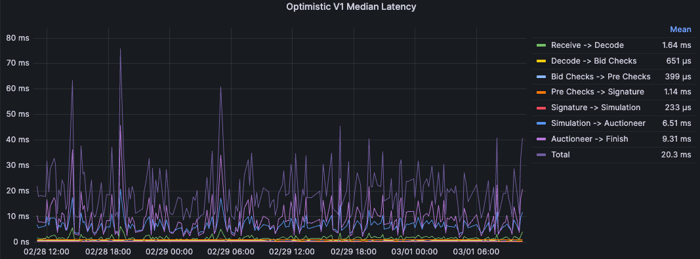
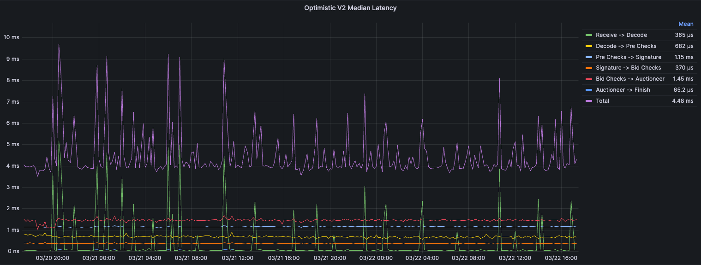

# Helix 🧬 - A Rust based high-performance MEV-Boost Relay 

## About Helix

Helix is a Rust-based MEV-Boost Relay implementation developed as an entirely new code base from the ground up. It has been designed with key foundational principles at its core, such as modularity and extensibility, low-latency performance, robustness and fault tolerance, geo-distribution, and a focus on reducing operational costs.

Our goal is to provide a code base that is not only technologically advanced but also aligns with the evolving needs of proposers, builders, and the broader Ethereum community.


## Key Features:

### Optimised Relay Flows

The PBS relay operates using two distinct flows, each with its own unique key requirements:
- **Submit_block -> Get_header Flow (Latency):** Currently, this is the only flow where latency is critically important. Our primary focus is on minimising latency while considering redundancy as a secondary priority. Future enhancements will include hyper-optimising the `get_header` and `get_payload` flows for latency (see the Future Work section for more details).
- **Get_header -> Get_payload Flow (Redundancy):** Promptly delivering the payload following a `get_header` request is essential. A delay in this process risks the proposer missing their slot, making high redundancy in this flow extremely important.

### Geo-Distribution and Global Accessibility: 
The current Flashbots MEV-Boost relay [implementation](https://github.com/flashbots/mev-boost-relay) is limited to operating as a single cluster. As a result, relays tend to aggregate in areas with a high density of proposers, particularly AWS data centres in North Virginia and Europe. This situation poses a significant disadvantage for proposers in locations with high network latency in these areas. To prevent missed slots, proposers in such locations are compelled to adjust their MEV-Boost configuration to call `get_header` earlier, which leads to reduced MEV rewards. In response, we have designed our relay to support geo-distribution. This allows multiple clusters to be operated in different geographical locations simultaneously, whilst collectively serving the relay API as one unified relay endpoint.

- Our design supports multiple geo-distributed clusters under a single relay URL.
- Automatic call routing via DNS resolution ensures low latency communication to relays.
- We've addressed potential non-determinism, such as differing routes for `get_header` and `get_payload`, by implementing the `GossipClientTrait` using gRPC, which ensures payload availability across all clusters.

### Optimistic V2
OptimisticV2, initially proposed [here](https://frontier.tech/optimistic-relays-and-where-to-find-them), introduces an architectural change where the lightweight header (1 MTU) is decoupled from the much heavier payload. Due to the much smaller size, the header can be quickly downloaded, deserialised and saved. Ready for `get_header` responses. Meanwhile, the much heavier full SignedBidSubmission is downloaded and verified asynchronously.

We have implemented two distinct endpoints for builders: `submit_header` and `submit_block_v2`. Builders will be responsible for ensuring that they only use these endpoints if their collateral covers the block value and that they submit payloads in a timely manner to the relay. Builders that fail to submit payloads will have their collateral slashed in the same process as the current Optimistic V1 implementation.

Along with reducing the internal latency, separating the header and payload drastically reduces the network latency.

### Filtering Support

To efficiently manage transactions based on regional policies, our relay operations have been streamlined as follows:

- **Unified Relay System**: Both regional and global filtering are integrated into a single relay system, allowing proposers to specify their filtering preferences during registration.
- **Simplified Registration**: Proposers can communicate their filtering preference through two different URLs: [titanrelay.xyz](https://titanrelay.xyz) for global filtering and [regional.titanrelay.xyz](https://regional.titanrelay.xyz) for regional filtering. Registration to either URL will automatically set the appropriate preference. All other calls will be routed the same way.
- **Builder Adaptations**: Builders need to adapt to the system changes. The [proposers](https://flashbots.github.io/relay-specs/#/Builder/getproposers) API response will now include a `preferences` field indicating the chosen filtering mode. Minor adjustments to internal logic are required, as filtering is now managed on a per-validator basis.


### Modular and Generic Design
- Emphasising generic design, Helix allows for flexible integration with various databases and libraries. 
- Key Traits include: `Database`, `Auctioneer`, `Simulator` and `BeaconClient`.
- The current `Auctioneer` implementation supports Redis due to the ease of implementation when synchronising multiple processes in the same cluster. 
- The `Simulator` is also purposely generic, allowing for implementations of all optimistic relaying implementations and different forms of simulation. For example, communicating with the execution client via RPC or gRPC.

### Optimised Block Propagation
- To ensure efficient block propagation without the need for sophisticated Beacon client peering, we've integrated a `Broadcaster` Trait, allowing integration with network services like [Fiber](https://fiber.chainbound.io) for effective payload distribution.
- Similar to the current MEV-Boost-relay implementation, we include a one-second delay before returning unblinded payloads to the proposer. This delay is required to mitigate attack vectors such as the recent [low-carb-crusader](https://collective.flashbots.net/t/disclosure-mitigation-of-block-equivocation-strategy-with-early-getpayload-calls-for-proposers/1705) attack. Consequently, the relay takes on the critical role of beacon-chain block propagation.
- In the future, we will be adding a custom module that will handle optimised peering

## Latency Analysis

*These latency measurements were taken on mainnet over multiple days handling full submissions from all Titan builder clusters.*



Analysing the latency metrics presented, we observe significant latency spikes in two distinct segments: `Receive -> Decode` and `Simulation -> Auctioneer`. Note: `Auctioneer -> Finish` is irrelivant as the bid will be available to the ProposerAPI at `Auctionner`.

`Receive -> Decode`. The primary sources of latency can be attributed to the handling of incoming byte streams and their deserialisation into the `SignedBidSubmission` structure. This latency is primarily incurred due to the following:

- Byte Stream Processing: The initial step involves reading the incoming byte stream into a memory buffer, specifically using `hyper::body::to_bytes(body)`. This step is necessary to translate raw network data into a usable byte vector. Its latency is heavily influenced by the size of the incoming data and the efficiency of the network I/O operations.
- GZIP Decompression: For compressed payloads, the GZIP decompression process can introduce significant computational overhead, especially for larger payloads.
- Deserialisation Overhead: This is the final deserialisation step, where the byte vector is converted into a `SignedBidSubmission` object using either SSZ or JSON.

`Simulation -> Auctioneer`. In this section, we store all necessary information about the payload, preparing it to be returned by `get_header` and `get_payload`. This is handled using Redis in the current implementation, which can introduce significant latency, especially for larger payloads.

It is worth mentioning that all submissions during this period were simulated optimistically. If this weren’t the case, we would see most of the latency being taken up by `Bid checks -> Simulation`.

## OptimisticV2 Latency Analysis
*These latency measurements were taken on mainnet over multiple days handling full submissions from all Titan builder clusters.*



The graphs illustrate a marked reduction in latency across several operational segments, with the most notable improvements observed in the Receive -> Decode and Bid Checks -> Auctioneer phases.

In addition to the improvements made in internal processing efficiency, using the OptimisticV2 implementation has resulted in significantly lower network latencies from our builders.

## How to run
The relay can be run locally for development, or configured for staging and production environments. Depending on the setup, you may want to leverage Docker for building and running the service, along with a Postgres database, Redis instance.

#### Local setup
```bash
# Build the image
$ docker build -t helix_mev_relayer -f local.Dockerfile .

# Run the container
$ docker run --name helix_mev_relayer helix_mev_relayer
```

#### Staging or Production-Ready setup
AWS configuration is required as a cloud storage option for [sccache](https://github.com/mozilla/sccache.git) (a rust wrapper for caching builds for faster development).
For environments closer to production, you can use the provided [Dockerfile](./Dockerfile). In these environments, [sccache](https://github.com/mozilla/sccache.git) can be configured to store build artifacts in AWS S3 for faster incremental builds. You must supply your AWS credentials as build arguments:

```bash
$ docker build \
  --build-arg AWS_ACCESS_KEY_ID=<your_aws_access_key_id> \
  --build-arg AWS_SECRET_ACCESS_KEY=<your_aws_secret_access_key> \
  --build-arg REPO_NAME=<your_repo_name> \
  -t helix_mev_relayer .

$ docker run --name helix_mev_relayer helix_mev_relayer
```

### Configuration

[config.yml](./config.yml) contains options for the relay.

### Databases
The relay relies on postgres database for persistent storage. Ensure you point the `config.postgres` settings to a database with `timescaledb` extension installed and enabled.

For Redis set `config.redis.url` to a connection url to a running redis instance.

### The simulator service
`config.simulators`: should be an RPC endpoint for the payload validator. This service is responsible for sending block requests to the relay for validation.

### Beacon client
Beacon clients provide APIs for validators to register and propose blocks. You can point the relay to one or multiple beacon clients using `config.beacon_clients`. Examples: [Prysm](https://github.com/prysmaticlabs/prysm.git), [Lighthouse](https://github.com/sigp/lighthouse.git).

It is the **Consensus Layer** (CL) of the blockchain and is dependent on an **Execution Layer** (EL).

Each beacon client must have **HTTP API** enabled and requires a working EL client like [geth](https://github.com/ethereum/go-ethereum.git) or [reth](https://github.com/paradigmxyz/reth.git) (Rust ecosystem). Make sure both CL and EL are synchronized and accessible to the relay.

### Logging
Logs are tailed in `config.logging`. when there is a panic call by `panic::set_hook` logging is done in **{config.dir_path}/crash.log**.

You can also add a webhook to log `panic!` messages to discord using the `config.discord_webhook_url`. Note this uses `reqwest::blocking` under the hood.

### Additional Notes
- Ensure that your environment is properly set up before starting the relay (e.g., databases running, AWS credentials ready if using sccache).
- For best performance in production, always verify that your beacon and execution clients are properly synced and that the relay has the appropriate network permissions.

## Future Work

### In-Memory Auctioneer
In multi-relay cluster configurations, synchronising the best bid across all nodes is crucial to minimise redundant processing. Currently, this synchronisation relies on Redis. While the current `RedisCache` implementation could be optimised further, we plan on shifting to an in-memory model for our Auctioneer component, eliminating the reliance on Redis for critical-path functions.

Our approach will separate `Auctioneer` functionalities based on whether they lie in the critical path. Non-critical path functions will continue to use Redis for synchronisation and redundancy. However, critical-path operations like `get_last_slot_delivered` and `check_if_bid_is_below_floor` will be moved in-memory. To ensure that we minimise redundant processing, each header update will gossip between local instances.

### Optimised beacon client peering
As stated in the "Optimised Block Propagation" section, we plan to develop a module dedicated to optimal beacon client peering. This module will feature a dynamic network crawler designed to fingerprint network nodes to enhance peer discovery and connectivity.


### PEPC
In line with the design principles of Protocol Enforced Proposer Commitments (PEPC) [PEPC](https://ethresear.ch/t/unbundling-pbs-towards-protocol-enforced-proposer-commitments-pepc/13879), we aim to offer more granularity in allowing proposers to communicate their preferences regarding the types of blocks they wish to commit to. Currently, this is achieved through the `preferences` field, which enables proposers to indicate whether they prefer to commit to a regional or global filtering policy. In the future, we plan to support additional preferences, such as commitment to blocks adhering to relay-established inclusion lists, blocks produced by trusted builders, and others.


## Compatability
- For proposers, Helix is fully compatible with the current MEV-Boost relay spec.
- For builders, there's a requirement to adapt to these changes as the [proposers](https://flashbots.github.io/relay-specs/#/Builder/getproposers) API response will now contain an extra `preferences` field. Minor changes are also required to the internal logic, as filtering moves from a per-relay basis to a per-validator basis.

## Credit to:
Flashbots:
- https://github.com/flashbots/mev-boost-relay

Alex Stokes. A lot of the types used are derived/ taken from these repos:
- https://github.com/ralexstokes/ethereum-consensus
- https://github.com/ralexstokes/mev-rs
- https://github.com/ralexstokes/beacon-api-client

## Audits
- Audit conducted by Spearbit, with [Alex Stokes](https://github.com/ralexstokes) (EF) and [Matthias Seitz](https://github.com/mattsse) (Reth, Foundry, ethers-rs) leading as security researchers. See the report [here](audits/spearbit-audit.pdf).

## License
MIT + Apache-2.0


## Contact
https://twitter.com/titanbuilderxyz
